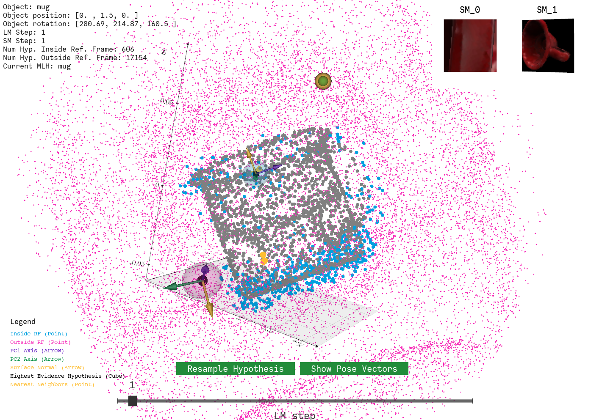
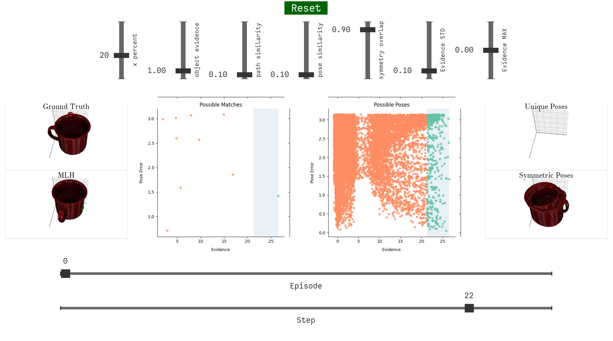

# tbp.plot

This is a visualization tool for plotting [tbp.monty](https://github.com/thousandbrainsproject/tbp.monty) visualizations.

- [Gallery](#gallery)
- [Installation](#installation)
- [Usage](#usage)
- [Development](#development)


## Gallery

<table width="100%">
  <tr>
    <th width="50%">Burst Sampling</th>
    <th width="50%">Hypothesis Space</th>
  </tr>
  <tr>
    <td align="center">
      
    </td>
    <td align="center">
      
    </td>
  </tr>
</table>

<table width="100%">
  <tr>
    <th width="50%">Reference Frame</th>
    <th width="50%">Terminal Conditions</th>
  </tr>
  <tr>
    <td align="center">
      
    </td>
    <td align="center">
      
    </td>
  </tr>
</table>


## Installation

To use the tool, all you need to do is clone this repository. If you intend to do development on this repository, see the [Development](#development) section for the development setup.

### Install `uv`

On a Mac, `brew install uv` is sufficient. For other platforms, see the [uv installation instructions](https://docs.astral.sh/uv/getting-started/installation/).

### Install dependencies

```bash
uv sync
```

This creates a virtual environment in `.venv/` and installs package dependencies as well as the `plot` console script.

## Usage

After installation you can run the following command to list all available plots:

```bash
$ uv run plot

Available plots:

  interactive_objects_evidence_over_time: Interactive visualization for objects, MLH and sensor locations
```

To run one of the available plots, run:

```bash
$ uv run plot interactive_objects_evidence_over_time [args]
```

For a list of plot-specific args, use the help menu with:

```bash
$ uv run plot interactive_objects_evidence_over_time [-h|--help]

usage: plot interactive_objects_evidence_over_time [-h] [--objects_mesh_dir OBJECTS_MESH_DIR] [-lm LEARNING_MODULE] experiment_log_dir

Arguments for plot 'interactive_objects_evidence_over_time'

positional arguments:
  experiment_log_dir    The directory containing the experiment log with the detailed stats file.

options:
  -h, --help            show this help message and exit
  --objects_mesh_dir OBJECTS_MESH_DIR
                        The directory containing the mesh objects.
  -lm, --learning_module LEARNING_MODULE
                        The name of the learning module (default: "LM_0").

```


## Contributions

### Ideas for Contributions

We're always looking to improve the visualization tools available, and would love to see any plotting widgets you have developed.

If you're looking to contribute but don't know where to start, you can check out our [Issues page](https://github.com/thousandbrainsproject/tbp.plot/issues) for items that need tackling. These cover a mixture of things from refactoring work to debugging and proposals for new visualizations. 

### Development Setup

> [!NOTE]
> First, **make a fork of this repository**. Make any changes on your local fork. This repository is configured to only accept pull requests from forks.

The development of this project is managed with [uv](https://docs.astral.sh/uv/), "a single tool to replace `pip`, `pip-tools`, `pipx`, `poetry`, `pyenv`, `twine`, `virtualenv`, and more." You will need to install it.

We use `uv` as it tracks the latest PEP standards while relying on existing infrastructure like `pip`, `venv`, etc.

`uv.lock` is non-standard in Python, but as Python does not yet define a lockfile standard, any lockfile format is non-standard. The benefit of `uv.lock` is that it is cross-platform and "captures the packages that would be installed across all possible Python markers such as operating system, architecture, and Python version". This makes it safe to check-in to the repository.

### Adding new plots

Plots live under `src/tbp/plot/plots`. Each plot module defines two things:
1. **A main function** decorated with `@register`, which is the plot entry point.
2. **An optional add_arguments function** decorated with `@attach_args`, which defines the plot's CLI argparse arguments.

```python
# src/tbp/plot/plots/my_new_plot.py
import argparse
from tbp.plot.registry import register, attach_args

@register("my_new_plot", description="Example of a new plot")
def main(arg1: str, arg2: int) -> int:
    print(f"Running my_new_plot with arg1={arg1} and arg2={arg2}")
    # your plotting logic here...
    return 0

@attach_args("my_new_plot")
def add_arguments(p: argparse.ArgumentParser) -> None:
    p.add_argument("--arg1", required=True, help="The first argument.")
    p.add_argument("--arg2", type=int, default=100, help="The second argument.")
```

Once you add this file, it will be auto-discovered.

```bash
$ uv run plot

Available plots:

  interactive_objects_evidence_over_time: Interactive visualization for objects, MLH and sensor locations
  my_new_plot                           : Example of a new plot

$ uv run plot my_new_plot --arg1 "test" --arg2 50
Running my_new_plot with arg1=test and arg2=50
```

### Running Development Tools

All development tools can be run through `uv run`:

```bash
uv run ruff check        # lint & style
uv run ruff format       # auto-format
uv run deptry src tests  # dependency checks
uv run mypy              # type checks
uv run pytest            # run tests
```

To build the package:

```bash
uv build
```

