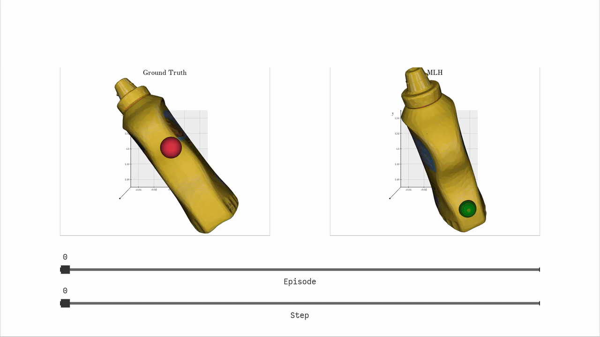
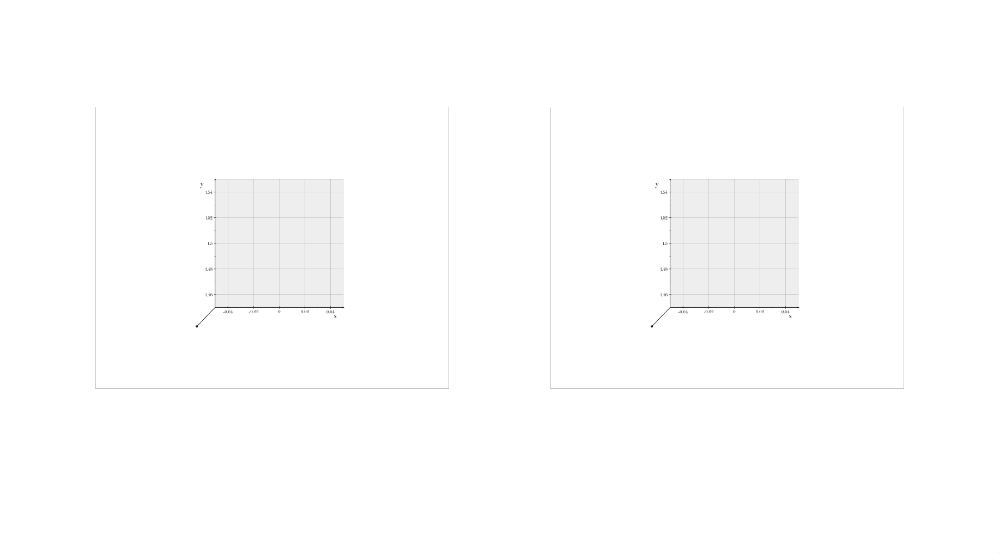
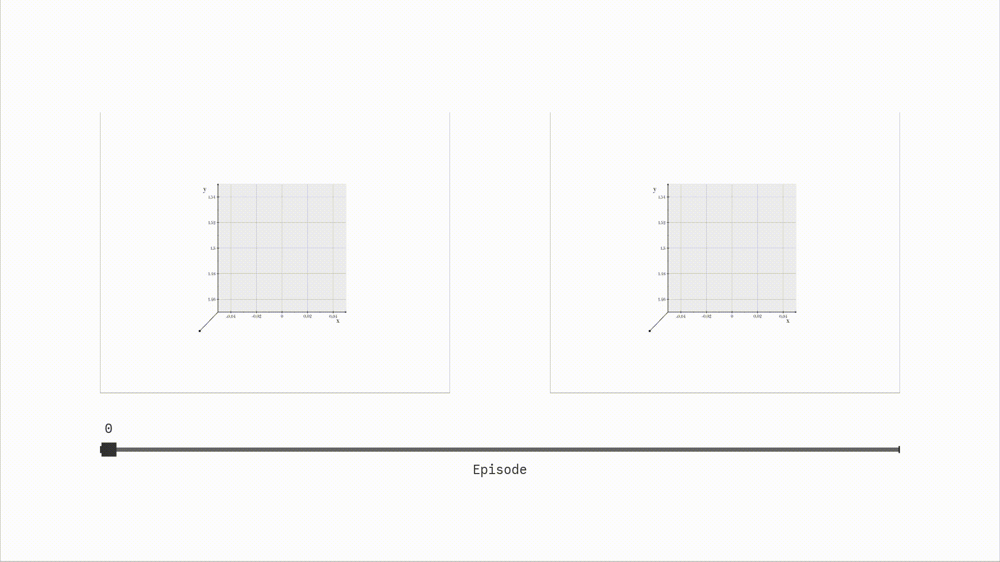
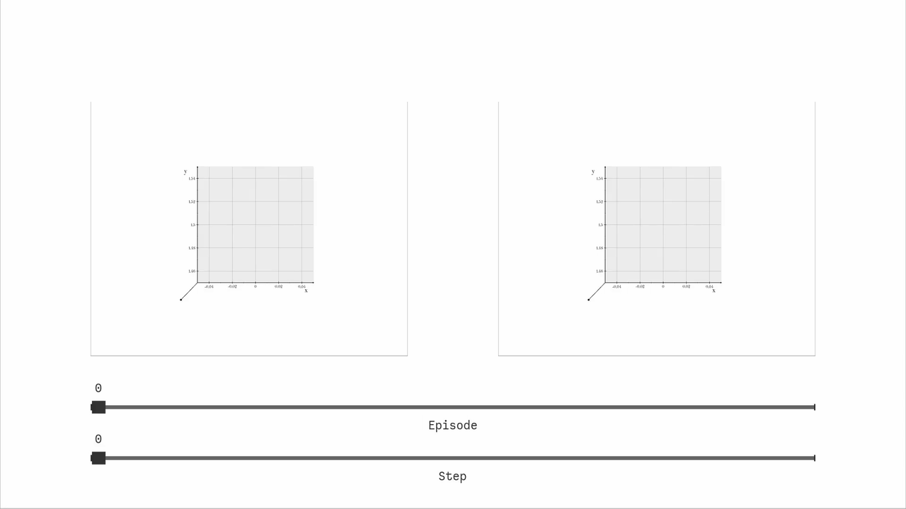
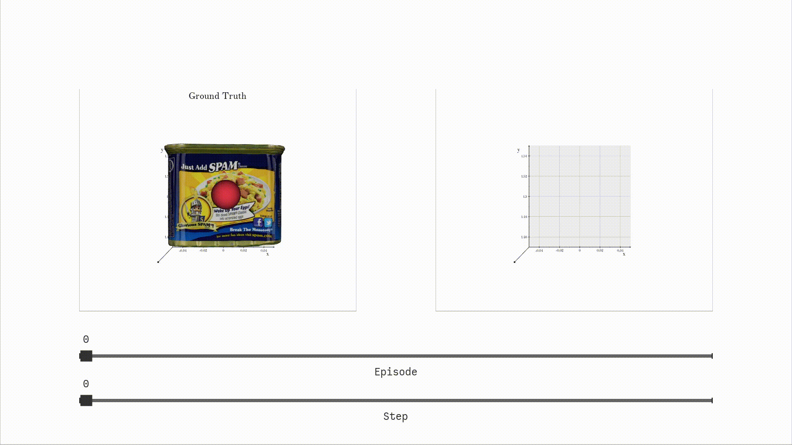

## Building a Simple Interactive Plot Step by Step


In a [previous tutorial](../data_parser/tutorial.md), we learned about how the `DataParser` and `DataLocator` classes allow us to define a path to query and extract data from experiment logs.
In this tutorial, we will build a simple interactive plot that uses a pub/sub architecture for communication between widgets.

We will construct an interactive plot gradually, starting from an empty scene and then adding four widgets, one at a time.
Each widget introduces a new concept, but all of them follow the same core idea: widgets do not talk to each other directly.
Instead, they publish and listen to messages using a [publish–subscribe pattern](https://en.wikipedia.org/wiki/Publish%E2%80%93subscribe_pattern), where widgets emit messages on named topics and other widgets react to those topic messages without direct references to each other.

By the end of this tutorial, you will understand how sliders and meshes are added to an interactive plot and how they are synchronized through topic messages.
Along the way, we will introduce the `Widget` and `WidgetUpdater` classes, and we will implement several `WidgetOps` classes that define each Widget's behavior.
Note that the interactive visualizations in `tbp.plot` are built using the [Vedo 3D library](https://vedo.embl.es/), which is a high-level wrapper around the visualization toolkit [VTK](https://vtk.org/).


The animation below shows the final interactive plot we will build in this tutorial. Episode and step sliders control the scene, while the ground-truth object and the most likely hypothesis (MLH) update automatically in response.




---

## Part 1: Create and Register a Minimal Interactive Plot

In this section, we will set up the interactive plot class.
It will open a window with three renderers, load the experiment JSON logs, and instantiate useful classes, e.g., `Plotter` and `Publisher`, that widgets will share later.
There are no widgets yet, but by the end of this section, you will have a runnable plot that is registered with the plotting command-line interface (CLI).

Create a new file under: `src/tbp/plot/plots/interactive_tutorial.py`

Plots placed under `src/tbp/plot/plots/` are indexed by the plot registry, which is what makes them discoverable and runnable through the plotting registered function (i.e., functions with the decorator `@register`).

Below is the complete starting code for Part 1.

```python
# Copyright 2025 Thousand Brains Project
#
# Copyright may exist in Contributors' modifications
# and/or contributions to the work.
#
# Use of this source code is governed by the MIT
# license that can be found in the LICENSE file or at
# https://opensource.org/licenses/MIT.

import argparse
import logging
from copy import deepcopy
from pathlib import Path

from pubsub.core import Publisher
from tbp.interactive.data import (
    DataParser,
    YCBMeshLoader,
)
from tbp.interactive.widgets import (
    VtkDebounceScheduler,
)
from tbp.plot.registry import attach_args, register
from vedo import Plotter

logger = logging.getLogger(__name__)


class InteractivePlot:
    """An interactive plot for a simple tutorial."""

    def __init__(
        self,
        exp_path: str,
        data_path: str,
    ):
        renderer_areas = [
            {"bottomleft": (0.0, 0.0), "topright": (1.0, 1.0)},
            {"bottomleft": (0.1, 0.3), "topright": (0.45, 0.8)},
            {"bottomleft": (0.55, 0.3), "topright": (0.9, 0.8)},
        ]

        self.axes_dict = {
            "xrange": (-0.05, 0.05),
            "yrange": (1.45, 1.55),
            "zrange": (-0.05, 0.05),
        }
        self.cam_dict = {"pos": (0, 0, 1), "focal_point": (0, 0, 0)}

        self.data_parser = DataParser(exp_path)
        self.ycb_loader = YCBMeshLoader(data_path)
        self.event_bus = Publisher()
        self.plotter = Plotter(shape=renderer_areas, sharecam=False).render()
        self.scheduler = VtkDebounceScheduler(self.plotter.interactor, period_ms=33)

        # Show the plot renderers
        self.plotter.at(0).show(
            camera=deepcopy(self.cam_dict),
            interactive=False,
            resetcam=False,
        )
        self.plotter.at(1).show(
            axes=deepcopy(self.axes_dict),
            interactive=False,
            resetcam=True,
        )
        self.plotter.at(2).show(
            axes=deepcopy(self.axes_dict),
            interactive=True,
            resetcam=True,
        )


@register(
    "interactive_tutorial",
    description="Simple tutorial with four widgets",
)
def main(experiment_log_dir: str, objects_mesh_dir: str) -> int:
    """Interactive tutorial visualization.

    Args:
        experiment_log_dir: Path to the experiment directory containing the detailed
            stats file.
        objects_mesh_dir: Path to the root directory of YCB object meshes.

    Returns:
        Exit code.
    """
    if not Path(experiment_log_dir).exists():
        logger.error(f"Experiment path not found: {experiment_log_dir}")
        return 1

    data_path = str(Path(objects_mesh_dir).expanduser())

    InteractivePlot(experiment_log_dir, data_path)

    return 0


@attach_args("interactive_tutorial")
def add_arguments(p: argparse.ArgumentParser) -> None:
    p.add_argument(
        "experiment_log_dir",
        help=(
            "The directory containing the experiment log with the detailed stats file."
        ),
    )
    p.add_argument(
        "--objects_mesh_dir",
        default="~/tbp/data/habitat/objects/ycb/meshes",
        help=("The directory containing the mesh objects."),
    )
```

### Registering the Plot with `@register`

The `@register` decorator declares a new plot entry named `interactive_tutorial`.
This name is the handle you will use with the plotting CLI to run this plot.
The registry scans the files under `src/tbp/plot/plots/` and collects any functions decorated with `@register`.
The registered `main` function is the plot’s entrypoint, where all the plotting code is placed.

### Attaching CLI Arguments with `@attach_args`

The `@attach_args` decorator links an argument definition function to the plot.
This allows the user to add argparse arguments, which will be passed to the function `main`.

In this tutorial, we define one required argument, `experiment_log_dir`,
and one optional argument, `--objects_mesh_dir`, which defaults to the YCB mesh directory.

### The `InteractivePlot` Class

Inside `InteractivePlot.__init__`, we instantiate all the classes that the widgets will share.

- `DataParser(exp_path)` loads and provides access to the experiment log.
Later widgets will use locators to query and extract episode and step data from it.

- `YCBMeshLoader(data_path)` provides the ability to load textured meshes for YCB object IDs.
We initialize it here so any mesh visualization widget can reuse it.

- `Publisher()` creates the shared event bus.
In later sections, widgets will publish topic messages to this bus and subscribe to them through updaters.

- `VtkDebounceScheduler(plotter, period_ms)` provides a central "debounce" mechanism so widget updates can be throttled.
Interactive widgets can produce a high volume of callbacks, especially while dragging sliders.
Throttling with a debounce mechanism ensures the plot updates smoothly and stays responsive, rather than attempting to render computationally intense objects many times in a short period of time.

### Renderers and `Vedo.Plotter`

The plot window is split into multiple renderers using the `shape=renderer_areas` layout.
Each entry in `renderer_areas` defines a rectangle in normalized coordinates.
You can access each renderer by index with `self.plotter.at(i)`.
We also set `sharecam=False` so each renderer can have independent camera settings.

### Starting the Visualization

Finally, we call `.show(...)` on each renderer to initialize them with the right configuration.

Even though renderer 0 is mainly used as a UI area (sliders and other widgets), we still call `show()` on it to initialize its viewport and apply a camera configuration; every renderer needs to have a camera to render its widgets.
Renderers 1 and 2 are intended for 3D content, so we initialize them with axes.
In Vedo, an important detail is that `show(interactive=True)` starts the interactive event loop and blocks any further execution.
This means that the script effectively “stops here” and waits for user input, and you typically do not run additional setup code after that call.

For this reason, we call `show(interactive=False)` on renderers 0 and 1 while we are still constructing the full scene.
These calls set up the renderers without entering the blocking interaction loop.
Finally, we call `show(interactive=True)` once at the end (i.e., on renderer 2), which starts the event loop and makes the whole window responsive to user interaction, including widgets placed in renderers 0.

At this stage, running the plot should open a window with three regions and no widgets, as shown below.
To run the plot, you can use the command `uv run plot interactive_tutorial /path/to/experiment/logs/dir`





## Part 2: Add an Episode Slider Widget

In this part, we add the first widget to the plot, the episode slider.
We will do this in two steps.
First, we will add a `create_widgets()` method and create a `Widget` instance.
After that, we will implement the `WidgetOps` class that defines how the slider is created, how its state is extracted and set, and how it publishes topic messages.


### Adding a Widget to `InteractivePlot`

Start by updating the imports to include the widget wrapper and the slider.
The rest of the file stays the same for now.

```python
from vedo import Plotter, Slider2D

from tbp.interactive.widgets import (
    VtkDebounceScheduler,
    Widget,
)
```

Now update `InteractivePlot.__init__` so it creates and adds widgets before showing the renderers.
At this point, the widget will not work yet, because we have not implemented its WidgetOps class.


```python
class InteractivePlot:
    """An interactive plot for a simple tutorial."""

    def __init__(self, exp_path: str, data_path: str):
        # ... same setup as Part 1 ...

        self.data_parser = DataParser(exp_path)
        self.ycb_loader = YCBMeshLoader(data_path)
        self.event_bus = Publisher()
        self.plotter = Plotter(shape=renderer_areas, sharecam=False).render()
        self.scheduler = VtkDebounceScheduler(self.plotter.interactor, period_ms=33)

        # NEW: Create and add widgets
        self._widgets = self.create_widgets()
        for w in self._widgets.values():
            w.add()

        # NEW: Set an initial value for the episode slider
        self._widgets["episode_slider"].set_state(0)

        # ... same .show(...) calls as Part 1 ...
```

Next, add a `create_widgets()` method to the class.
This method is where we construct all widgets and decide how they are wired to the bus and scheduler.

```python
    def create_widgets(self):
        widgets = {}

        widgets["episode_slider"] = Widget[Slider2D, int](
            widget_ops=EpisodeSliderWidgetOps(
                plotter=self.plotter,
                data_parser=self.data_parser,
            ),
            scopes = [],
            bus=self.event_bus,
            scheduler=self.scheduler,
            debounce_sec=0.0,
            dedupe=False,
        )

        return widgets
```


This is the first time we see the Widget wrapper.
The Widget takes a `widget_ops` object, which defines the widget type and behavior, as well as other sharable objects like the event bus and scheduler.
The Widget wrapper is responsible for connecting UI callbacks to the bus.
The WidgetOps object is responsible for the widget-specific behavior, such as how to create the VTK widget and how to interpret/set its state.


### Implementing `EpisodeSliderWidgetOps`

Now we define the widget behavior. Add the following imports:

```python
from collections.abc import Callable, Iterable

from tbp.interactive.data import DataLocator, DataLocatorStep
from tbp.interactive.topics import TopicMessage
from tbp.interactive.widgets import extract_slider_state, set_slider_state
```

Then add the `EpisodeSliderWidgetOps` class above `InteractivePlot`:

```python
class EpisodeSliderWidgetOps:
    """WidgetOps implementation for an Episode slider.

    This class sets the slider's range based on the number of
    available episodes and publishes changes as `TopicMessage` items
    under the "episode_number" topic.
    """

    def __init__(self, plotter: Plotter, data_parser: DataParser) -> None:
        self.plotter = plotter
        self.data_parser = data_parser

        self._add_kwargs = {
            "xmin": 0,
            "xmax": 10,
            "value": 0,
            "pos": [(0.1, 0.2), (0.9, 0.2)],
            "title": "Episode",
        }

        self._locators = self.create_locators()

    def create_locators(self) -> dict[str, DataLocator]:
        locators = {}
        locators["episode"] = DataLocator(
            path=[DataLocatorStep.key(name="episode")],
        )
        return locators

    def add(self, callback: Callable[[Slider2D, str], None]) -> Slider2D:
        kwargs = deepcopy(self._add_kwargs)
        locator = self._locators["episode"]
        kwargs.update({"xmax": len(self.data_parser.query(locator)) - 1})

        widget = self.plotter.at(0).add_slider(callback, **kwargs)
        self.plotter.at(0).render()
        return widget

    def extract_state(self, widget: Slider2D) -> int:
        return extract_slider_state(widget)

    def set_state(self, widget: Slider2D, value: int) -> None:
        set_slider_state(widget, value)

    def state_to_messages(self, state: int) -> Iterable[TopicMessage]:
        return [TopicMessage(name="episode_number", value=state)]
```

The most important method here is `state_to_messages()`.
This is where widget state becomes part of the pub/sub system.
Every time the slider changes, the Widget wrapper asks `EpisodeSliderWidgetOps` for messages representing the new state.
In this case, the widget publishes a single message named `episode_number` whose value is the selected episode index.

The `add()` method is also important.
Instead of hard-coding the slider range, it queries the experiment log for available episodes and sets `xmax` accordingly.
This keeps the UI consistent with the data, even if the number of episodes changes between runs.

If you have not seen `DataLocator` before, it is worth skimming the earlier [DataParser and DataLocator tutorial](../data_parser/tutorial.md).
In short, locators let the widget describe the path it needs from the experiment log once, and then reuse that defined data path whenever it needs to query or extract data.

At the end of this part, the slider should be visible in renderer 0, and moving it publishes `episode_number` messages.
See the animation below:





## Part 3: Add a Step Slider That Reacts to the Episode Slider

In Part 2, we added the episode slider and saw how a widget can publish state as a topic message.
In this part, we add the step slider, and this is the first time we introduce subscriptions.
The step slider depends on the currently selected episode because each episode can have a different number of valid steps.
That means the step slider must listen for messages on the topic `episode_number` and adjust its range whenever the episode changes.

We will follow the same pattern as before.
First, we create the widget in `InteractivePlot.create_widgets()`.
Then we implement the `StepSliderWidgetOps` class.
The new concept is `WidgetUpdater`, which lets a widget react to one or more topics and update itself in response.


### Add the Step Slider Widget to `InteractivePlot`

Start by adding the new imports for `WidgetUpdater`, `TopicSpec`.

```python
from tbp.interactive.topics import TopicMessage, TopicSpec
from tbp.interactive.widget_updaters import WidgetUpdater
```


Now extend `create_widgets()` to include the new widget.
The episode slider stays the same, and we append a second widget called `step_slider`.

```python
def create_widgets(self):
    widgets = {}

    # Stays the same
    widgets["episode_slider"] = Widget[Slider2D, int](...)

    # NEW: step slider
    widgets["step_slider"] = Widget[Slider2D, int](
        widget_ops=StepSliderWidgetOps(
            plotter=self.plotter,
            data_parser=self.data_parser,
        ),
        scopes = [],
        bus=self.event_bus,
        scheduler=self.scheduler,
        debounce_sec=0.3,
        dedupe=True,
    )

    return widgets
```

Both sliders share the same bus and scheduler. The difference is what their WidgetOps implementation does.


### Implement `StepSliderWidgetOps`

Now we define the behavior for the step slider.
The step slider looks similar to the episode slider at first glance.
It adds a Slider2D, reads state, sets state, and publishes messages.
The important difference is that it also defines an updaters list.
This is where subscription logic lives.

Add the class below `EpisodeSliderWidgetOps` and above `InteractivePlot`.


```python
class StepSliderWidgetOps:
    """WidgetOps implementation for a Step slider.

    This class listens for the current episode selection and adjusts the step
    slider range to match the number of steps in that episode. It publishes
    changes as `TopicMessage` items under the "step_number" topic.
    """

    def __init__(self, plotter: Plotter, data_parser: DataParser) -> None:
        self.plotter = plotter
        self.data_parser = data_parser

        # NEW: subscriptions for this widget
        self.updaters = [
            WidgetUpdater(
                topics=[TopicSpec("episode_number", required=True)],
                callback=self.update_slider_range,
            )
        ]

        self._add_kwargs = {
            "xmin": 0,
            "xmax": 10,
            "value": 0,
            "pos": [(0.1, 0.1), (0.9, 0.1)],
            "title": "Step",
        }
        self._locators = self.create_locators()

    def create_locators(self) -> dict[str, DataLocator]:
        locators = {}
        locators["step"] = DataLocator(
            path=[
                DataLocatorStep.key(name="episode"),
                DataLocatorStep.key(name="lm", value="LM_0"),
                DataLocatorStep.key(
                    name="telemetry", value="time"
                ),
                DataLocatorStep.index(name="step"),
            ]
        )
        return locators

    def add(self, callback: Callable) -> Slider2D:
        widget = self.plotter.at(0).add_slider(callback, **self._add_kwargs)
        self.plotter.at(0).render()
        return widget

    def extract_state(self, widget: Slider2D) -> int:
        return extract_slider_state(widget)

    def set_state(self, widget: Slider2D, value: int) -> None:
        set_slider_state(widget, value)

    def state_to_messages(self, state: int) -> Iterable[TopicMessage]:
        return [TopicMessage(name="step_number", value=state)]

    def update_slider_range(
        self, widget: Slider2D, msgs: list[TopicMessage]
    ) -> tuple[Slider2D, bool]:
        msgs_dict = {msg.name: msg.value for msg in msgs}

        widget.range = [
            0,
            len(
                self.data_parser.query(
                    self._locators["step"], episode=str(msgs_dict["episode_number"])
                )
            )
            - 1,
        ]

        self.set_state(widget, 0)
        self.plotter.at(0).render()

        return widget, True
```


### Understanding `WidgetUpdater` and `TopicSpec`

This is the first time we see an explicit subscription.
A `WidgetUpdater` is essentially a small rule that says: when a specific set of topic messages is available, call a function.

The topics a `WidgetUpdater` cares about are described by `TopicSpec` objects.
In this case, the step slider has a single `TopicSpec("episode_number", required=True)`.
That means the updater will only run if an `episode_number` message is present, and it will receive those messages as the msgs argument in `update_slider_range()`.

The callback signature is important.
The callback takes the widget instance being updated (e.g., `Slider2D`) and the list of messages that matched the updater’s topic specs.
The callback returns (widget, publish), where publish determines whether the Widget wrapper should publish messages after the update.
We return `True` here because after resetting the step slider to 0, we want to publish `step_number = 0` so the rest of the widgets can know about this change.

Dragging the episode slider will change the valid range of the step slider and reset it back to 0.
Dragging the step slider will also publish `step_number` messages, even though nothing subscribes to these messages yet.
See the animation below:




## Part 4: Add the Ground-Truth Mesh Visualizer

In Part 3, we added the step slider and introduced `WidgetUpdater` as the mechanism that allows a widget to react to topic messages.
In this part, we add our first display-only widget: a ground-truth mesh visualizer.
This widget listens to `episode_number` and `step_number`, loads the target object mesh from YCB, and renders both the object and a simple agent visualization.

Just like before, we start by wiring the widget into `InteractivePlot.create_widgets()`.
Then we implement the `GtMeshWidgetOps` class.
The new concepts introduced here are the `YCBMeshLoader` and a more sophisticated use of `WidgetUpdater`, where a single widget can react to different combinations of topics.

### Add the Ground-Truth Widget to `InteractivePlot`

We first extend the imports because this widget renders meshes and uses a few additional `vedo` primitives.

```python
import numpy as np
from vedo import Sphere, Line, Mesh, Sphere, Text2D
from scipy.spatial.transform import Rotation
```


Now add the widget in `create_widgets()`.
This follows the same pattern as the sliders, except the widget type is `Mesh` and the state type is `None` because this widget is display-only and does not publish messages.

```python
def create_widgets(self):
    widgets = {}

    # ... episode_slider, step_slider ...

    widgets["primary_mesh"] = Widget[Mesh, None](
        widget_ops=GtMeshWidgetOps(
            plotter=self.plotter,
            data_parser=self.data_parser,
            ycb_loader=self.ycb_loader,
        ),
        scopes = [],
        bus=self.event_bus,
        scheduler=self.scheduler,
        debounce_sec=0.5,
        dedupe=True,
    )

    return widgets
```

Notice that this is the first time we pass an extra dependency into the WidgetOps constructor, `ycb_loader`.
We already created `self.ycb_loader = YCBMeshLoader(data_path)` in Part 1, and now we finally use it.
This is a common pattern in interactive plots; you initialize shared resources once in the class constructor and pass them into whichever widgets need them.

At this point, the widget is wired into the plot, but we still need to define what it does. That is `GtMeshWidgetOps`.

### Implement `GtMeshWidgetOps`

The ground-truth widget has two distinct behaviors, and we implement each one as a separate `WidgetUpdater`.

The first behavior runs when `episode_number` changes. It loads the new ground-truth object mesh and renders it.
The second behavior runs when both `episode_number` and `step_number` are updated.
It updates the sensor sphere and gaze line based on the selected step.


When the step changes, we do not want to reload the object mesh each time.
Instead, we update only the sensor visualization.
That update requires both `episode_number` and `step_number`, so we model it as a second updater with two required topic specs.


```python
class GtMeshWidgetOps:
    """WidgetOps implementation for rendering the ground-truth target mesh.

    This widget is display-only. It listens for "episode_number" updates,
    loads the target object's YCB mesh, applies the episode-specific rotations,
    scales and positions it, and adds it to the plotter. It does not publish
    any messages.
    """

    def __init__(
        self, plotter: Plotter, data_parser: DataParser, ycb_loader: YCBMeshLoader
    ):
        self.plotter = plotter
        self.data_parser = data_parser
        self.ycb_loader = ycb_loader

        # NEW: multiple updaters for different topic combinations
        self.updaters = [
            WidgetUpdater(
                topics=[TopicSpec("episode_number", required=True)],
                callback=self.update_mesh,
            ),
            WidgetUpdater(
                topics=[
                    TopicSpec("episode_number", required=True),
                    TopicSpec("step_number", required=True),
                ],
                callback=self.update_sensor,
            ),
        ]

        self._locators = self.create_locators()

        self.gaze_line: Line | None = None
        self.sensor_sphere: Sphere | None = None

        # A small label for the renderer
        self.plotter.at(1).add(Text2D(txt="Ground Truth", pos="top-center"))

    def create_locators(self) -> dict[str, DataLocator]:
        locators = {}

        locators["target"] = DataLocator(
            path=[
                DataLocatorStep.key(name="episode"),
                DataLocatorStep.key(name="lm", value="target"),
            ]
        )

        locators["steps_mask"] = DataLocator(
            path=[
                DataLocatorStep.key(name="episode"),
                DataLocatorStep.key(name="system", value="LM_0"),
                DataLocatorStep.key(name="telemetry", value="lm_processed_steps"),
            ]
        )

        locators["sensor_location"] = DataLocator(
            path=[
                DataLocatorStep.key(name="episode"),
                DataLocatorStep.key(name="system", value="motor_system"),
                DataLocatorStep.key(name="telemetry", value="action_sequence"),
                DataLocatorStep.index(name="sm_step"),
                DataLocatorStep.index(name="telemetry_type", value=1),
                DataLocatorStep.key(name="agent", value="agent_id_0"),
                DataLocatorStep.key(name="pose", value="position"),
            ]
        )

        locators["patch_location"] = DataLocator(
            path=[
                DataLocatorStep.key(name="episode"),
                DataLocatorStep.key(name="system", value="LM_0"),
                DataLocatorStep.key(name="telemetry", value="locations"),
                DataLocatorStep.key(name="sm", value="patch"),
                DataLocatorStep.index(name="step"),
            ]
        )

        return locators

    def remove(self, widget: Mesh) -> None:
        if widget is not None:
            self.plotter.at(1).remove(widget)
            self.plotter.at(1).render()

    def update_mesh(self, widget: Mesh, msgs: list[TopicMessage]) -> tuple[Mesh, bool]:
        self.remove(widget)
        msgs_dict = {msg.name: msg.value for msg in msgs}

        target = self.data_parser.extract(
            self._locators["target"], episode=str(msgs_dict["episode_number"])
        )
        target_id = target["primary_target_object"]
        target_rot = target["primary_target_rotation_quat"]
        target_pos = target["primary_target_position"]

        try:
            widget = self.ycb_loader.create_mesh(target_id).clone(deep=True)
        except FileNotFoundError:
            return widget, False

        rot = Rotation.from_quat(np.array(target_rot), scalar_first=True)
        rot_euler = rot.as_euler("xyz", degrees=True)
        widget.rotate_x(rot_euler[0])
        widget.rotate_y(rot_euler[1])
        widget.rotate_z(rot_euler[2])
        widget.shift(*target_pos)

        self.plotter.at(1).add(widget)
        self.plotter.at(1).render()

        # Display-only widget, so do not publish
        return widget, False

    def update_sensor(self, widget: None, msgs: list[TopicMessage]) -> tuple[None, bool]:
        msgs_dict = {msg.name: msg.value for msg in msgs}
        episode_number = msgs_dict["episode_number"]
        step_number = msgs_dict["step_number"]

        steps_mask = self.data_parser.extract(
            self._locators["steps_mask"], episode=str(episode_number)
        )
        mapping = np.flatnonzero(steps_mask)

        sensor_pos = self.data_parser.extract(
            self._locators["sensor_location"],
            episode=str(episode_number),
            sm_step=int(mapping[step_number]),
        )

        patch_pos = self.data_parser.extract(
            self._locators["patch_location"],
            episode=str(episode_number),
            step=step_number,
        )

        if self.sensor_sphere is None:
            self.sensor_sphere = Sphere(pos=sensor_pos, r=0.01)
            self.plotter.at(1).add(self.sensor_sphere)
        self.sensor_sphere.pos(sensor_pos)

        if self.gaze_line is None:
            self.gaze_line = Line(sensor_pos, patch_pos, c="black", lw=2)
            self.plotter.at(1).add(self.gaze_line)
        self.gaze_line.points = [sensor_pos, patch_pos]

        self.plotter.at(1).render()

        # Display-only widget, so do not publish
        return widget, False
```


Renderer 1 is no longer empty.
When you change the episode slider, the ground-truth object mesh updates.
When you change the step slider, a small sensor marker and a gaze line update to show where the sensor is and what it is looking at for the current step.
See the animation below:





## Part 5: Add the MLH Visualizer

In Part 4, we added the ground-truth mesh and used `WidgetUpdater` with multiple updaters inside a single widget.
In this final part, we add the MLH visualizer.
Conceptually, it is very similar to the ground-truth widget; it listens to the same topics and renders a mesh.
Instead of loading the episode’s ground-truth target, it reads the model’s current best hypothesis (MLH) at the selected step and renders that object plus a small marker at the MLH location.

We will follow the same two-step approach as before. First, we add the widget to `InteractivePlot.create_widgets()`.
Then we implement the `MlhMeshWidgetOps` class.

### Add the MLH Widget to `InteractivePlot`

In `create_widgets()`, add the following widget after the ground-truth widget.
This is also a display-only widget, so the state type is `None`.

```python
def create_widgets(self):
    widgets = {}

    # ... episode_slider, step_slider, primary_mesh ...

    widgets["Mlh_mesh"] = Widget[Mesh, None](
        widget_ops=MlhMeshWidgetOps(
            plotter=self.plotter,
            data_parser=self.data_parser,
            ycb_loader=self.ycb_loader,
        ),
        scopes = [],
        bus=self.event_bus,
        scheduler=self.scheduler,
        debounce_sec=0.5,
        dedupe=True,
    )

    return widgets
```

### Implement `MlhMeshWidgetOps`

Now we define the widget behavior.
This widget has a single updater that requires both `episode_number` and `step_number`, because the MLH changes over time and depends on the step.
Whenever either selection changes, we update the mesh and the MLH location marker.


```python
class MlhMeshWidgetOps:
    """WidgetOps implementation for rendering the MLH mesh.

    This widget is display-only. It listens for `"episode_number"` and
    `"step_number"` updates, loads the current MLH hypothesis from the log,
    renders the corresponding YCB mesh, and places a small marker at the
    hypothesis location.
    """

    def __init__(
        self, plotter: Plotter, data_parser: DataParser, ycb_loader: YCBMeshLoader
    ):
        self.plotter = plotter
        self.data_parser = data_parser
        self.ycb_loader = ycb_loader

        self.updaters = [
            WidgetUpdater(
                topics=[
                    TopicSpec("episode_number", required=True),
                    TopicSpec("step_number", required=True),
                ],
                callback=self.update_mesh,
            ),
        ]

        self._locators = self.create_locators()

        self.default_object_position = (0, 1.5, 0)
        self.sensor_circle: Circle | None = None

        self.plotter.at(2).add(Text2D(txt="MLH", pos="top-center"))

    def create_locators(self) -> dict[str, DataLocator]:
        locators = {}
        locators["mlh"] = DataLocator(
            path=[
                DataLocatorStep.key(name="episode"),
                DataLocatorStep.key(name="lm", value="LM_0"),
                DataLocatorStep.key(name="telemetry", value="current_mlh"),
                DataLocatorStep.index(name="step"),
            ]
        )
        return locators

    def update_mesh(self, widget: Mesh, msgs: list[TopicMessage]) -> tuple[Mesh, bool]:
        if widget is not None:
            self.plotter.at(2).remove(widget)

        if self.sensor_circle is not None:
            self.plotter.at(2).remove(self.sensor_circle)
            self.sensor_circle = None

        msgs_dict = {msg.name: msg.value for msg in msgs}

        mlh = self.data_parser.extract(
            self._locators["mlh"],
            episode=str(msgs_dict["episode_number"]),
            step=msgs_dict["step_number"],
        )
        mlh_id = mlh["graph_id"]
        mlh_rot = mlh["rotation"]
        mlh_pos = mlh["location"]

        try:
            widget = self.ycb_loader.create_mesh(mlh_id).clone(deep=True)
        except FileNotFoundError:
            return widget, False

        rot = Rotation.from_euler("xyz", np.array(mlh_rot), degrees=True).inv()
        rot_euler = rot.as_euler("xyz", degrees=True)
        widget.rotate_x(rot_euler[0])
        widget.rotate_y(rot_euler[1])
        widget.rotate_z(rot_euler[2])
        widget.shift(*self.default_object_position)

        self.plotter.at(2).add(widget)

        self.sensor_circle = Sphere(pos=mlh_pos, r=0.01).c("green")
        self.plotter.at(2).add(self.sensor_circle)

        self.plotter.at(2).render()

        return widget, False
```

This concludes the tutorial.
The ground-truth visualizer should now show the mesh and a step-dependent sensor visualization.
The MLH visualizer should show the current MLH hypothesis mesh and a small green marker at the MLH location.
Moving either slider updates both views by publishing and subscribing to specific topics.
See the animation below:


